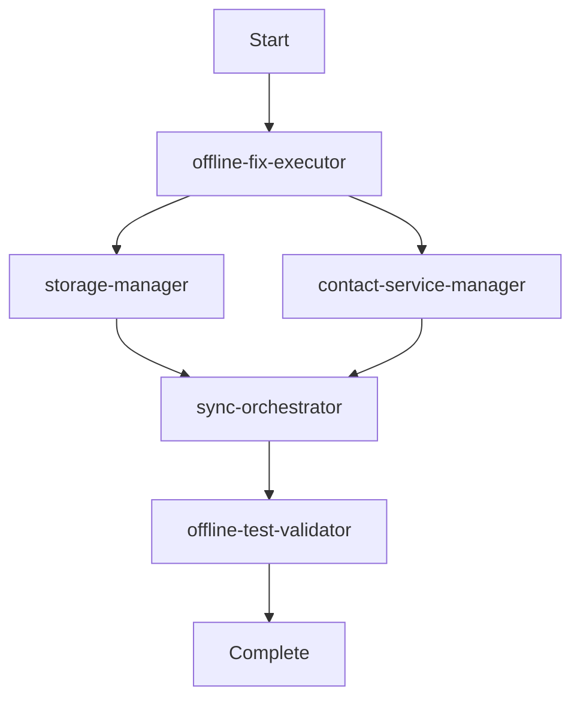

# NAMECARD.MY Specialized Agents Guide

## 🎯 Overview

Five specialized agents work together to execute the critical offline-first architecture fixes for NAMECARD.MY. Each agent has deep expertise in its domain and can be invoked through Claude Code's Task tool.

## 🤖 Available Agents

### 1. **offline-fix-executor**
**Purpose**: Execute CRITICAL_FIX_EXECUTION_PLAN.md systematically
**Expertise**: Architecture transformation, offline-first patterns
**Key Tasks**:
- Remove authentication dependencies
- Implement LocalStorage as primary
- Make Supabase optional
- Validate offline functionality

### 2. **storage-manager**
**Purpose**: Handle all LocalStorage operations
**Expertise**: Data persistence, sync queues, image storage
**Key Tasks**:
- Save/retrieve contacts locally
- Manage sync queue
- Handle image storage
- Optimize storage usage

### 3. **contact-service-manager**
**Purpose**: Manage unified ContactService layer
**Expertise**: Business logic, CRUD operations, search
**Key Tasks**:
- Implement offline-first CRUD
- Handle OCR integration
- Export/import contacts
- Cache management

### 4. **offline-test-validator**
**Purpose**: Comprehensive offline testing
**Expertise**: Test automation, validation, performance testing
**Key Tasks**:
- Test all features offline
- Validate data persistence
- Check performance metrics
- Generate test reports

### 5. **sync-orchestrator**
**Purpose**: Background synchronization management
**Expertise**: Queue processing, conflict resolution, batch operations
**Key Tasks**:
- Process sync queue
- Resolve conflicts
- Handle retries
- Monitor sync health

## 🔄 Agent Workflow

### For Complete Offline Fix:


### Execution Order:
1. **offline-fix-executor** - Analyzes and plans the fix
2. **storage-manager** - Implements LocalStorage layer
3. **contact-service-manager** - Refactors services
4. **sync-orchestrator** - Sets up background sync
5. **offline-test-validator** - Validates everything works

## 💻 How to Use

### Invoke Individual Agent:
```typescript
// Using Task tool in Claude Code
Task.run({
  agent: 'storage-manager',
  task: 'Initialize LocalStorage and migrate existing data',
  context: 'NAMECARD.MY offline-first implementation'
});
```

### Chain Multiple Agents:
```typescript
// Sequential execution
const agents = [
  { name: 'offline-fix-executor', task: 'Analyze current architecture' },
  { name: 'storage-manager', task: 'Implement LocalStorage' },
  { name: 'contact-service-manager', task: 'Refactor to offline-first' },
  { name: 'offline-test-validator', task: 'Validate offline mode' }
];

for (const agent of agents) {
  await Task.run(agent);
}
```

### Parallel Execution:
```typescript
// Run independent agents in parallel
await Promise.all([
  Task.run({ agent: 'storage-manager', task: 'Setup storage' }),
  Task.run({ agent: 'sync-orchestrator', task: 'Configure sync' })
]);
```

## 📋 Common Tasks

### Task 1: Fix "Foreign Key Constraint" Error
```bash
Agents: offline-fix-executor → storage-manager
Actions:
1. Remove auth dependencies
2. Implement local storage
3. Make operations work offline
```

### Task 2: Implement Offline Camera
```bash
Agents: contact-service-manager → storage-manager
Actions:
1. Remove Supabase from camera
2. Save images locally
3. Queue for background sync
```

### Task 3: Test Offline Functionality
```bash
Agent: offline-test-validator
Actions:
1. Enable airplane mode
2. Test all features
3. Validate data persistence
4. Generate report
```

### Task 4: Setup Background Sync
```bash
Agent: sync-orchestrator
Actions:
1. Configure sync queue
2. Setup retry logic
3. Implement conflict resolution
4. Start background processing
```

## 🎯 Agent Capabilities Matrix

| Agent | Create | Read | Update | Delete | Sync | Test | Fix |
|-------|--------|------|--------|--------|------|------|-----|
| offline-fix-executor | ✅ | ✅ | ✅ | ✅ | - | - | ✅ |
| storage-manager | ✅ | ✅ | ✅ | ✅ | ✅ | - | - |
| contact-service-manager | ✅ | ✅ | ✅ | ✅ | - | - | - |
| offline-test-validator | - | ✅ | - | - | - | ✅ | - |
| sync-orchestrator | - | ✅ | ✅ | - | ✅ | - | - |

## 🔧 Agent Coordination

### Data Flow:
```
Components
    ↓
contact-service-manager
    ↓
storage-manager
    ↓
sync-orchestrator → Supabase (optional)
    ↓
offline-test-validator (validation)
```

### Error Handling:
```
Error Detected
    ↓
offline-fix-executor (analyze)
    ↓
Appropriate Agent (fix)
    ↓
offline-test-validator (verify)
```

## 📊 Success Metrics

Each agent tracks its own metrics:

### offline-fix-executor
- Architecture converted: ✓/✗
- Auth dependencies removed: count
- Offline features enabled: %

### storage-manager
- Storage operations: <50ms
- Data persistence: 100%
- Queue efficiency: items/sec

### contact-service-manager
- CRUD operations: <100ms
- Search performance: <50ms
- Cache hit rate: %

### offline-test-validator
- Tests passed: count
- Offline coverage: %
- Performance met: ✓/✗

### sync-orchestrator
- Queue length: count
- Sync success rate: %
- Conflict resolution: count

## 🚀 Quick Start Commands

### Full Offline Fix:
```bash
# Execute complete fix
Task: offline-fix-executor
Action: "Execute CRITICAL_FIX_EXECUTION_PLAN.md"
```

### Test Current State:
```bash
# Validate offline functionality
Task: offline-test-validator
Action: "Run complete offline test suite"
```

### Setup Storage:
```bash
# Initialize local storage
Task: storage-manager
Action: "Setup LocalStorage and migrate data"
```

### Fix Sync Issues:
```bash
# Repair sync problems
Task: sync-orchestrator
Action: "Diagnose and fix sync issues"
```

## ⚠️ Important Notes

1. **Agents are specialized** - Use the right agent for the task
2. **Order matters** - Some agents depend on others
3. **Test after changes** - Always run offline-test-validator
4. **Monitor sync** - Check sync-orchestrator status regularly
5. **Backup first** - Agents will backup but verify

## 🎉 Result

With these 5 specialized agents, you can:
- Execute the complete offline-first transformation
- Fix all authentication/foreign key errors
- Ensure 100% offline functionality
- Maintain data consistency
- Monitor sync health

**The agents work together to transform NAMECARD.MY into a robust offline-first application!**