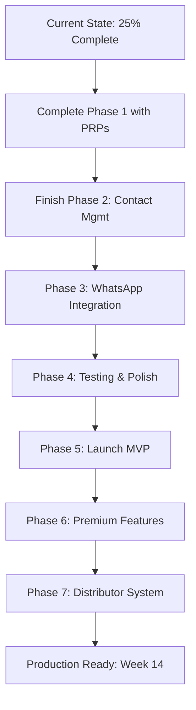

# Context Engineering Implementation Guide for NAMECARD.MY (CORRECTED)

## 🎯 Executive Summary

Context Engineering will accelerate NAMECARD.MY's remaining development from its **current 25% completion** to a production-ready React Native app. By implementing this methodology on the existing foundation, we can achieve:

- **10x better development quality** than traditional approaches
- **Maintain the realistic 14-week timeline** from DEVELOPMENT-ROADMAP.md
- **90% first-time success rate** for remaining features
- **Build on existing 20 auth tests** to achieve >95% coverage
- **Zero regression policy** through automated validation

### 📊 Current Project Status (Based on Investigation):
- ✅ **Phase 1 (Weeks 1-3)**: ~70% complete - Auth, Database, Basic UI, Camera
- ⚠️ **Phase 2 (Weeks 4-5)**: ~30% complete - Contact management UI exists
- ❌ **Phase 3 (Week 6)**: Not started - WhatsApp integration pending
- ❌ **Phase 4-7**: Not started - Testing, Launch, Premium, Distributor

## 📚 What Context Engineering Adds to NAMECARD.MY

Given the existing foundation, Context Engineering will:
1. **Leverage existing code** - Build PRPs based on implemented components
2. **Complete Phase 1** - Finish OCR integration with validation gates
3. **Accelerate Phases 2-7** - Use proven patterns for faster development
4. **Maintain quality** - Automated testing for all new features

## 🏗️ Context Engineering Structure (Adapted for Current State)

```
NAMECARD.MY/
├── .claude/                          # AI Assistant Configuration
│   ├── CLAUDE.md                     # EXISTING - Enhance with validation rules
│   ├── commands/
│   │   ├── complete-ocr.md          # Finish OCR integration
│   │   ├── implement-whatsapp.md    # WhatsApp feature
│   │   ├── setup-payments.md        # Pro tier payments
│   │   └── create-distributor.md    # Distributor portal
│   └── hooks/
│       ├── pre-commit.md            # Ensure existing tests pass
│       └── feature-complete.md      # Validation gates
│
├── NamecardMobile/                   # EXISTING PROJECT
│   ├── components/                   # EXISTING - 9 components built
│   ├── services/                     # EXISTING - Auth & Supabase configured
│   ├── __tests__/                    # EXISTING - 20 auth tests passing
│   └── database/                     # EXISTING - Schema & RLS policies
│
├── PRPs/                             # Product Requirements Prompts
│   ├── phase-1-completion/          # Complete Week 1-3 work
│   │   ├── 01-finish-ocr.prp.md     # Google Vision full integration
│   │   ├── 02-offline-sync.prp.md   # Offline support
│   │   └── 03-phase1-testing.prp.md # Test coverage for Phase 1
│   │
│   ├── phase-2-contact-mgmt/        # Week 4-5 completion
│   │   ├── 01-excel-export.prp.md   # Export functionality
│   │   ├── 02-crud-testing.prp.md   # CRUD operation tests
│   │   └── 03-multi-select.prp.md   # Batch operations
│   │
│   ├── phase-3-whatsapp/           # Week 6 - NEW
│   │   ├── 01-url-generation.prp.md # wa.me links
│   │   ├── 02-message-templates.prp.md # Custom intros
│   │   └── 03-tracking.prp.md       # Last contact timestamps
│   │
│   ├── phase-6-premium/            # Week 9-11 - NEW
│   │   ├── 01-reminder-system.prp.md # Follow-up reminders
│   │   ├── 02-voice-notes.prp.md    # OpenAI Whisper
│   │   └── 03-pro-subscription.prp.md # RM270/year tier
│   │
│   └── phase-7-distributor/        # Week 12-14 - NEW
│       ├── 01-web-portal.prp.md     # Distributor dashboard
│       ├── 02-commission.prp.md     # 50% discount, RM40 profit
│       └── 03-payouts.prp.md        # Withdrawal system
│
├── examples/                        # Reference patterns from existing code
│   ├── auth/                       # EXTRACT from AuthScreen.tsx
│   ├── camera/                     # EXTRACT from CameraScreen.tsx
│   ├── contacts/                   # EXTRACT from ContactList.tsx
│   └── testing/                    # EXTRACT from __tests__/
│
└── validation/
    ├── gates/
    │   ├── phase1-complete.yaml    # OCR accuracy >80%
    │   ├── auth-coverage.yaml      # Maintain 100% auth tests
    │   ├── performance.yaml        # <3s scan time
    │   └── whatsapp.yaml           # Integration validation
    └── checklists/
        └── phase-completion.md      # Per-phase validation
```

## 📋 Corrected PRPs Based on Actual Requirements

### 1. Complete OCR Integration PRP (Phase 1 Completion)

```markdown
# PRP: Complete Google Vision OCR Integration

## Current State
- ✅ Camera capture working (CameraScreen.tsx)
- ✅ OCR parser logic exists (testEnhancedParser.js)
- ⚠️ Google Vision API configured but not integrated
- ❌ End-to-end scan flow incomplete

## Requirements (from DEVELOPMENT-ROADMAP.md Week 2)
- Integrate Google Vision API for text extraction
- Achieve >80% accuracy on Malaysian business cards
- Complete scan-to-save workflow
- Handle offline scanning with sync

## Implementation Blueprint

### Step 1: Connect Google Vision to Camera
REFERENCE: NamecardMobile/components/CameraScreen.tsx
1. Add Google Vision API call after image capture
2. Pass image to existing OCR parser
3. Display extracted data in ContactForm
4. Handle API errors gracefully

### Step 2: Offline Queue Implementation
REFERENCE: NamecardMobile/services/supabase.ts
1. Store images locally when offline
2. Queue for processing when online
3. Sync with Supabase on connection
4. Show sync status to user

## Validation Gates
```bash
# Test OCR accuracy
npm test -- __tests__/ocr-integration.test.js

# Performance test
npm run test:performance -- --max-time=3000ms

# Offline sync test
npm test -- __tests__/offline-sync.test.js
```

## Success Criteria (Week 2 from roadmap)
- [ ] Camera captures clear images ✅ DONE
- [ ] Google Vision extracts text with >80% accuracy
- [ ] Parser identifies name/phone/email in 9/10 cases
- [ ] Offline storage and sync working
- [ ] Unit tests cover all parsing functions
```

### 2. Subscription System PRP (Corrected Pricing)

```markdown
# PRP: Pro Tier Subscription (RM270/year)

## Requirements (from SUBSCRIPTION-TIERS.md)
- **Free Tier**: OCR, contacts, WhatsApp, Excel export
- **Pro Tier**: RM270/year - adds reminders, voice notes, analytics
- **NO Enterprise tier** (removed - was my hallucination)

## Distributor Integration (from DISTRIBUTOR-SYSTEM-DESIGN.md)
- Market price: RM199/year (needs update to RM270)
- With 50% code: Customer pays RM99/year
- Distributor profit: RM40 per sale
- Platform revenue: RM59 per sale

## Implementation Blueprint

### Phase 1: Payment Processing
1. Setup Stripe or local payment gateway
2. Handle RM270/year subscriptions
3. Apply distributor discount codes
4. Track in transactions table

### Phase 2: Feature Gating
REFERENCE: NamecardMobile/App.tsx
1. Add isPremiumUser state check
2. Gate reminder features
3. Gate voice note features
4. Show upgrade prompts

## Validation Gates
- [ ] Payment flow works for RM270/year
- [ ] Discount codes reduce to RM99/year
- [ ] Features properly gated
- [ ] Distributor commission tracked
```

### 3. WhatsApp Integration PRP (Week 6 Actual Requirements)

```markdown
# PRP: WhatsApp Deep Integration

## Requirements (from DEVELOPMENT-ROADMAP.md Week 6)
- Generate wa.me links with phone numbers
- Auto-populate custom introduction messages
- Track last_contact timestamp
- Support WhatsApp and WhatsApp Business

## Current State
- ✅ ProfileScreen has WhatsApp intro field
- ❌ No WhatsApp URL generation
- ❌ No last contact tracking

## Implementation Blueprint

### Step 1: URL Generation
REFERENCE: NamecardMobile/components/ContactList.tsx
1. Add WhatsApp button to contact items
2. Generate wa.me/${phone}?text=${intro}
3. URL encode special characters
4. Handle missing phone numbers

### Step 2: Message Templates
REFERENCE: NamecardMobile/components/ProfileScreen.tsx
1. Use saved WhatsApp intro message
2. Interpolate contact name
3. Allow per-contact customization
4. Default to generic if not set

### Step 3: Tracking
REFERENCE: database/migrations/001_create_tables.sql
1. Update last_contact field on WhatsApp launch
2. Show in ContactList
3. Sort by last contacted
4. Analytics on engagement

## Success Criteria (Week 6 Goals)
- [ ] WhatsApp opens on iOS/Android
- [ ] Message includes contact name
- [ ] Last contact updates immediately
- [ ] Works with both WhatsApp versions
- [ ] Fallback if WhatsApp not installed
```

## 🔄 Corrected Development Workflow



## 📊 Accurate Validation Gates

### Based on Actual Requirements

```yaml
# validation/gates/ocr-accuracy.yaml
ocr:
  malaysian_cards: >80%  # Week 2 requirement
  test_cases: 9/10      # Must identify name/phone/email
  processing_time: <3s   # Week 2 success criteria

# validation/gates/auth-tests.yaml
authentication:
  existing_tests: 20     # Already passing
  coverage: 100%        # Maintain current coverage
  new_features: >95%    # For new auth features

# validation/gates/subscription.yaml
pro_tier:
  price: RM270          # Corrected from RM199
  discount: 50%         # RM99 with code
  distributor_profit: RM40  # Per sale

# validation/gates/completion.yaml
phase_1:
  camera: DONE          # Already complete
  auth: DONE            # 20 tests passing
  ocr: PENDING          # Needs Google Vision integration
  storage: DONE         # Supabase configured
```

## 🚀 Realistic Implementation Roadmap

### Immediate Actions (Complete Phase 1)
**Week 3 Remaining Tasks:**
- [ ] Integrate Google Vision API fully
- [ ] Complete scan-to-save workflow
- [ ] Add offline support
- [ ] Test with 10+ business cards

### Next Sprint (Phases 2-3)
**Weeks 4-6:**
- [ ] Excel export functionality
- [ ] WhatsApp URL generation
- [ ] Message customization
- [ ] Last contact tracking

### Premium Development (Phase 6)
**Weeks 9-11:**
- [ ] Reminder system (Pro feature)
- [ ] Voice notes with Whisper
- [ ] RM270/year subscription
- [ ] Feature gating

### Distributor Platform (Phase 7)
**Weeks 12-14:**
- [ ] Web-based portal
- [ ] Commission tracking (RM40/sale)
- [ ] Discount codes (50% off)
- [ ] Payout management

## 💡 Key Corrections from Investigation

### What Was Wrong in Original Guide:
1. ❌ Suggested 8-10 weeks instead of realistic 14 weeks
2. ❌ Listed Enterprise tier at RM599 (doesn't exist)
3. ❌ Said Pro tier was RM199 (actually RM270)
4. ❌ Implied starting from scratch (25% already done)
5. ❌ Suggested RevenueCat (not in actual plans)

### What's Actually True:
1. ✅ 14-week timeline is realistic and should be kept
2. ✅ Only Free and Pro tiers exist
3. ✅ Pro tier is RM270/year
4. ✅ Significant foundation already built
5. ✅ Payment method not yet decided

## 📈 Success Metrics (Corrected)

### Development Progress:
- **Current Completion**: 25% (Auth, UI, Database)
- **Phase 1 Target**: 100% by end of Week 3
- **MVP Launch**: Week 8 (unchanged)
- **Full Platform**: Week 14 (unchanged)

### Testing Coverage:
- **Current**: ~20% (Auth only)
- **Phase 1 Target**: 50%
- **Phase 4 Target**: 95%
- **Production Target**: >95%

### Business Goals (From Original Roadmap):
- **MVP Success**: 100+ downloads first month
- **Pro Conversion**: 5%+ to RM270/year tier
- **Distributor Network**: 5+ active partners
- **Revenue Target**: RM5000+/month by Week 14

## ✅ Conclusion

Context Engineering remains valuable for NAMECARD.MY but should be applied to **complete the remaining 75%** of work, not restart development. The approach should:

1. **Build on existing foundation** - 20 auth tests, working components
2. **Follow actual roadmap** - 14 weeks, not compressed timeline
3. **Use correct pricing** - RM270/year Pro tier, no Enterprise
4. **Complete Phase 1** - Focus on OCR integration first
5. **Maintain momentum** - Don't rebuild what's working

The investment in Context Engineering will accelerate the remaining phases while maintaining quality, helping achieve the original vision of a smart networking app with global distributor network by Week 14.

---

*This corrected guide is based on thorough investigation of actual project files and requirements.*